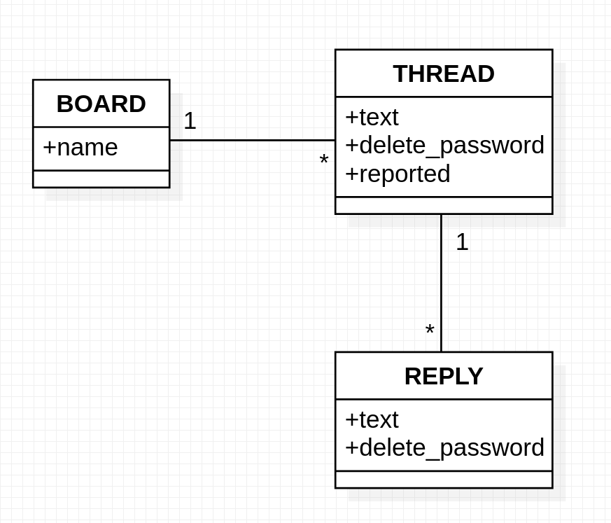

# Information Security and Quality Assurance Projects - Anon Message Board

## Description

This project is part of the **FCC Information Security and Quality Assurance Certification**.

## User stories

1. Only allow your site to be loading in an iFrame on your own pages. This is achieved setting `X-Frame-Options` header to `SAMEORIGIN`
2. Do not allow DNS prefetching. This is achieved setting `X-DNS-Prefetch-Control` header to `off`
3. Only allow your site to send the referrer for your own pages. This is achieved setting `Referrer-Policy` header to `same-origin`
4. I can `POST` a _thread_ to a specific _message board_ by passing form data text and delete\*password to `/api/threads/{board}`. Saved will be _id_, _text_, _created_on_(date&time), _bumped_on_(date&time, starts same as created*on), \_reported*(boolean), delete_password, & \_replies\*(array).
5. I can `POST` a _reply_ to a thead on a specific _board_ by passing form data _text_, _delete_password_, & _thread_id_ to `/api/replies/{board}` and it will also update the bumped*on date to the comments date.
   In the thread's \*'replies'* array will be saved \_id*, \_text*, _created_on_, _delete_password_, & _reported_.
6. I can `GET` an array of the most recent 10 bumped threads on the board with only the most recent 3 replies from `/api/threads/{board}`. The _reported_ and _delete_passwords_ fields will not be sent.
7. I can `GET` an entire _thread_ with all it's _replies_ from `/api/replies/{board}?thread_id={thread_id}`. Also hiding the same fields.
8. I can `DELETE` a _thread_ completely if I send a request to `/api/threads/{board}` and pass along the _thread_id_ & _delete_password_. (Text response will be _'incorrect password'_ or _'success'_)
9. I can `DELETE` a post (just changing the text to _'[deleted]'_) if I send a request to `/api/replies/{board}` and pass along the _thread_id_, _reply_id_, & _delete_password_. (Text response will be _'incorrect password'_ or _'success'_)
10. I can report a _thread_ and change it's reported value to true by sending a `PUT` request to `/api/threads/{board}` and pass along the _thread_id_. (Text response will be _'success'_)
11. I can report a reply and change it's reported value to true by sending a `PUT` request to `/api/replies/{board}` and pass along the _thread_id_ & _reply_id_. (Text response will be _'success'_)
12. Complete functional tests that wholely test routes and pass.

## Example usage

<https://fcc-anonymous-message-board.herokuapp.com/api/threads/general>

<https://fcc-anonymous-message-board.herokuapp.com/api/threads/general?thread_id=1>

<https://fcc-anonymous-message-board.herokuapp.com/api/boards>

Coded with music, coffee and love by _Claudio Cortese_
